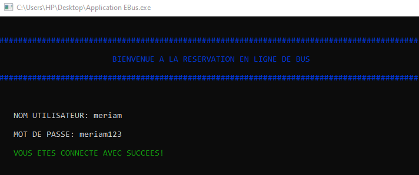

# Application de réservation de bus

E-Bus se présente comme une application en ligne de commande basée sur le langage C, dédiée à la réservation de bus pour les voyages. Cette application offre des fonctionnalités de gestion des bus, des réservations et des informations sur les voyageurs.

## Documentation

A l'aide de cette application, un voyageur peut:
* Se connecter (en saisissant son login et son mot de passe).
* Consulter la liste des bus disponibles.
* Faire une réservation.
* Annuler une reservation.
* Voir les détails des sièges d'un bus.
* Voir les détails d'une réservation.

## FAQ

### Question 1
En tant qu'utilisateur de cette application, comment je peut commencer à l'utiliser?

#### Réponse 1
Pour pouvoir manipuler cette application, l'utilisateur doit commencer par introduire son login et son mot de passe. Dans ce cas le login c'es"meriam" et le mot de passe est "meriam123".
### Question 2
Avec quel langage de programmation cette application a étée créée?
#### Réponse 2
Pour la création de cette application de réservation de bus, j'ai utilisé le langage C.

